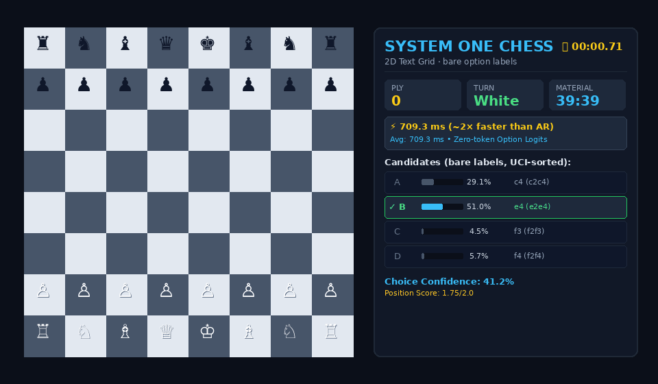

# systemone-lite

Local **typed decisions** on a **0.5B** model: you pass `state` + closed questions
(`yes/no`, choice, score); it returns **one discrete answer per question** by scoring
option tokens — not by writing JSON.

Compatible wire shape with the public
[System One API](https://docs.typesafe.ai/api.md). Independent project — **not**
TypeSafe / Jev, and **not** a cloud drop-in.

<p align="center">
  
</p>

<p align="center"><sub>Bare-face self-play GIF — entertainment only. Held-out JSON is the claim surface.</sub></p>

**Weights:** [`dwidlee/systemone-lite-0.5b`](https://huggingface.co/dwidlee/systemone-lite-0.5b) ·
**Data:** [`dwidlee/systemone-lite-phase2`](https://huggingface.co/datasets/dwidlee/systemone-lite-phase2) ·
**Consumer GPU** (numbers below: RTX 3060)

---

## Try it (≈1 minute)

```bash
git clone https://github.com/fritzprix/systemone-lite.git
cd systemone-lite
pip install -e ".[dev]"

systemone-lite --model dwidlee/systemone-lite-0.5b --port 8000

curl -s http://127.0.0.1:8000/v1/systemone \
  -H 'Content-Type: application/json' \
  -d @tests/fixtures/official_example_request.json
```

Python:

```python
from systemone_lite import SystemOneClient, choice, noul, score

client = SystemOneClient(model="dwidlee/systemone-lite-0.5b")
r = client.system_one(
    state="My card was charged twice.",
    questions={
        "needs_review": noul("Does this need a human agent?"),
        "route": choice(
            "Route to a team",
            {"billing": "charges", "technical": "bugs", "other": None},
        ),
        "urgency": score("Urgency", ["low", "medium", "high"]),
    },
)
print(r.answers["route"].choice)
```

OpenAPI sketch: [`openapi/systemone.yaml`](openapi/systemone.yaml).

---

## Why this exists

Most “LLM as router” demos generate prose and parse it. That is slow, flaky, and hard
to constrain. System One–style APIs ask for **ranked options**. This repo is a small,
trainable local implementation of that contract — useful for experiments, demos, and
benchmarking decision heads without a hosted stack.

---

## Numbers (local, honest)

Published Hub revision **action-v2-qwen**. Not an official JevBench leaderboard row
([request queued](https://github.com/fstandhartinger/jevbench/issues/107)).
n=800 SE ≈ ±1.8%p · n=231 SE ≈ ±3%p — treat small deltas as noise.

| | |
|---|---|
| Phase2 held-out `test` (n=4700) | **61.6%** |
| First-800 protocol | **63.9%** |
| JevBench public (231, T=1.0) | **50.7%** · ECE **0.245** · p50 **13.1 ms** |
| Short 1-question call | ~**10–30 ms** |
| vs greedy AR JSON (same weights) | ~**10–50×** fewer tokens / lower latency |

Uniform random on that JevBench set is ~**32%**, not 50%.
Weak on full `test`: game2048 ~35%, sokoban ~38%, chess ~42%. Ticket/routing near ceiling.

More GIFs (same protocol, no solver cheat): [`benchmarks/demos/action_v2_qwen/`](benchmarks/demos/action_v2_qwen/).  
Reports: [`phase2_heldout__action_v2_qwen.json`](benchmarks/phase2_heldout__action_v2_qwen.json) ·
[`jevbench_action_v2_qwen.json`](benchmarks/jevbench_action_v2_qwen.json) ·
[`latency_vs_ar.json`](benchmarks/latency_vs_ar.json).  
Write-up: [`docs/NOTE_ACTION_V2_QWEN_POSTMORTEM.md`](docs/NOTE_ACTION_V2_QWEN_POSTMORTEM.md).

---

## Limits

- **0.5B** — demos and local research, not a production decision service.
- **Calibration is mediocre** — do not treat `confidence` as calibrated probability.
- **Closed options only** — ranks given aliases; JSON keys are mapped after scoring.
- Use Hub dataset **`test`** for held-out claims — never `train`.
- Short self-play GIFs do **not** clear puzzles; do not cite them as Elo.

---

## Demos & retrain

```bash
pytest
python scripts/demo_systemone.py
python scripts/run_bare_demos.py --only action_v2_qwen
```

Publish always to the stable Hub id:

```bash
python scripts/upload_model_hf.py --dir checkpoints/<your-run>
# → dwidlee/systemone-lite-0.5b
```

Roadmap / phases: [`docs/ROADMAP.md`](docs/ROADMAP.md).

---

## License

MIT

## Acknowledgments

System One / Jev concepts and public API docs belong to their respective owners
(TypeSafe AI). This repo is an unofficial local approximation for experimentation.
