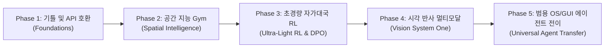

# systemone-lite Project Roadmap

> **TypeSafe System One 호환 초경량 Typed Decision 엔진에서  
> 공간 지능·강화학습·시각 반사(Visual Reflex) 범용 에이전트로의 진화 로드맵**

---

## 🎯 전체 비전 (Core Vision)
1. **System 1의 본질**: 장황한 텍스트 생성 대신 **초저지연(10~50ms) 단일 토큰 결정(Next-Token Decision)**으로 실시간 판단 수행.
2. **Wire Protocol 호환**: TypeSafe Jev의 `POST /v1/systemone` 규격을 100% 보존하여 기존 에이전트 인프라와 플러그앤플레이 연동.
3. **지능의 전이**: 엄격한 규칙을 가진 게임(체스, 공간 퍼즐, 레트로 아케이드)의 자가대국 강화학습을 통해 **공간 위상 인지, 인과 관계 예측, 엄격한 규칙 준수** 능력을 일반 비즈니스/OS 에이전트로 전이.
4. **단일 소비자 GPU(12GB VRAM) 최적화**: 8-bit Optimizer, LoRA, Single-Token DPO를 통해 RTX 3060 환경에서도 전체 훈련 루프 완결.

---

## 🗺️ Phase 로드맵 요약

---

## Phase 1: Foundations & TypeSafe Compatibility (기틀 및 API 호환)
> **상태: 95% 완료 (Mixed SFT 학습 진행 중)**

* **목표**: TypeSafe Jev Wire-compatible REST API 구현 및 0.5B 소형 모델 증류 기틀 확립
* **주요 마일스톤**:
  - [x] FastAPI 기반 `POST /v1/systemone` 엔드포인트 구현 (Noul, Choice, Score 규격)
  - [x] Causal LM Prefix-caching & Option-constrained Softmax 엔진 구축
  - [x] Qwen2.5-0.5B-Instruct 베이스라인 SFT 및 Hugging Face 배포 (`dwidlee/systemone-lite-0.5b`)
  - [x] 체스 100k 증류 데이터셋 구축 및 Stockfish 다단계 추론(2-Stage Decision) 데모 개발
  - [x] 80% 'A' 편향 버그 수정 및 데이터 밸런싱
  - [x] 파괴적 망각 방지를 위한 43.2k Mixed SFT 데이터셋 구성 및 훈련

---

## Phase 2: Spatial Intelligence & Multi-Game Gym (공간 지능 및 2D 텍스트 Gym)
> **상태: 진행 중 (데이터 합성 및 데모 구축 완료, 통합 학습 대기)**

* **목표**: ARC-AGI 수준의 공간 위상/장애물/인과 추론을 텍스트맵 기반 2D 게임을 통해 모델에 주입
* **주요 마일스톤**:
  - [x] 4종의 2D 공간 텍스트 Gym 및 합성기 구현:
    - **Sokoban**: 다단계 경로 계획 및 밀기(Push) 인과 추론
    - **2048**: 타일 이동 합성 및 보드 공간 관리
    - **GridWorld**: 장애물 최단 경로 및 목표 탐색 (BFS 증류)
    - **Connect Four**: 중력/선형 패턴 수 싸움 및 4목 판정
  - [x] 인터랙티브 터미널 데모 구축 (`scripts/*_demo.py`)
  - [ ] **기하학적 대칭성 데이터 증강 ($D_4$ Dihedral Group Augmentation)**:
    - **GridWorld, Sokoban, 2048**: 8방 대칭(90°/180°/270° 회전 4종 + 반전 4종) 적용으로 LLM의 좌상단 편향 파괴 및 8배 데이터 효율화
    - **Connect Four**: 중력 제약을 고려한 좌우 거울상(Mirror) 2배 증강
    - 회전에 따른 동형 행동 변환(Isomorphic Action Permutation, 예: `UP`→`RIGHT` 등) 엔진 구현
  - [ ] **Spatial + Chess + General 통합 v2 데이터셋 구축** 및 Co-training
  - [ ] 2D 공간 추론 및 회전 불변성(Rotation Invariance) 벤치마크 평가 슈트 구축

---

## Phase 3: Ultra-Light RL & Self-Play (초경량 자가대국 강화학습)
> **상태: 설계 완료 (GitHub Issue #1 등록)**

* **목표**: 12GB 단일 GPU에서 Full Actor-Critic 없이 **단일 토큰 DPO / GRPO**로 자가대국 강화학습 실현
* **주요 마일스톤**:
  - [ ] **메모리 최적화**:
    - `bitsandbytes` 8-bit AdamW 도입 (옵티마이저 VRAM 8GB → 2GB 절감)
    - LoRA(PEFT) 옵션 추가 (배치 사이즈 4 → 16~32 확장 가능)
  - [ ] **Reference Logprobs 오프라인 프리컴퓨팅**:
    - `ref_model`을 VRAM에 올리지 않고 사전 계산된 logprob 캐시로 DPO 수행 (추가 VRAM 0MB)
  - [ ] **체스/커넥트4 Self-Play 데이터 파이프라인**:
    - 모델 vs 모델 자가대국 수만 판 생성
    - 승리 궤적(`Chosen`)과 패배/실착 궤적(`Rejected`) 자동 페어링
  - [ ] **Single-Token DPO / GRPO 학습기 구현**:
    - 단일 Forward 로짓에서 즉시 손실 계산 및 정책 업데이트
  - [ ] 미니맥스/스톡피시 베이스라인 대비 레이팅(Elo) 상승 검증

---

## Phase 4: Multimodal Vision System One (시각 반사 멀티모달)
> **상태: 계획 단계**

* **목표**: 텍스트 맵을 넘어선 화면 스크린샷 직접 입력 지원 및 레트로 게임 실시간 시각 반사 제어
* **주요 마일스톤**:
  - [ ] **Wire-Compatible Vision Schema**:
    - `state` 내 `image` 필드(Base64 data-url 또는 Image path) 허용
    - TypeSafe API 호환성 유지
  - [ ] **초경량 VLM 백본 탑재**:
    - `SmolVLM-256M / 500M` 또는 `FastViT / MobileNet + Qwen-0.5B` 프로젝션
    - 50ms 이내 실시간 추론 속도 달성
  - [ ] **프레임 스태킹 (Frame Stacking)**:
    - 2~4프레임 연속 캡처로 객체의 속도/가속도 파악 지원
  - [ ] **Gym Atari 2600 / Retro 환경 연동**:
    - Pong, Breakout, Space Invaders 화면 캡처 및 행동 복제(Behavioral Cloning)

---

## Phase 5: Universal Agentic Transfer & Production (범용 전이 및 상용화)
> **상태: 비전 단계**

* **목표**: 게임으로 단련된 시스템 1 직관을 현실 세계의 GUI 자동화 및 프로덕션 서빙으로 전이
* **주요 마일스톤**:
  - [ ] **Game-to-GUI Transfer**:
    - 화면 캡처 기반 OS/브라우저 조작(Computer Use) 에이전트 라우팅
  - [ ] **프로덕션 서빙 최적화**:
    - vLLM / SGLang 기반 Prefix Caching 및 FP8 양자화 적용
    - p99 레이턴시 15ms 이하 달성
  - [ ] 오픈소스 릴리즈 및 벤치마크 논문/기술 리포트 공개
