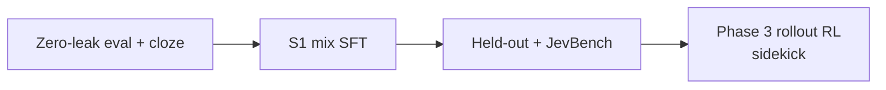
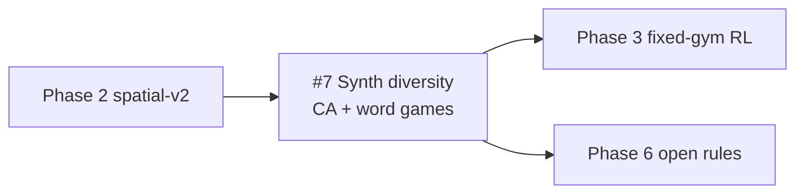
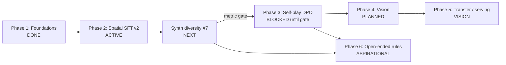

# systemone-lite Project Roadmap

> TypeSafe System One–compatible typed decision engine →
> spatial SFT → light self-play RL → vision reflex → transfer/serving →
> (aspirational) open-ended rule adaptation.

Tracking issues: [#6](https://github.com/fritzprix/systemone-lite/issues/6) Phase 1 (done) ·
[#2](https://github.com/fritzprix/systemone-lite/issues/2) Phase 2 ·
[#7](https://github.com/fritzprix/systemone-lite/issues/7) **Next: synth diversity** ·
[#1](https://github.com/fritzprix/systemone-lite/issues/1) / [#3](https://github.com/fritzprix/systemone-lite/issues/3) Phase 3 ·
[#4](https://github.com/fritzprix/systemone-lite/issues/4) Phase 4 ·
[#5](https://github.com/fritzprix/systemone-lite/issues/5) Phase 5 ·
Phase 6 (aspirational; early synth substrate = #7).

Measured Phase 1 note: [`NOTE_MIXED_SFT_2026-09-20.md`](NOTE_MIXED_SFT_2026-09-20.md).
Phase 2 v2 postmortem: [`NOTE_SPATIAL_V2_POSTMORTEM.md`](NOTE_SPATIAL_V2_POSTMORTEM.md).
Research log (2026-09-21): [`NOTE_RESEARCH_LOG_2026-09-21.md`](NOTE_RESEARCH_LOG_2026-09-21.md) — gate, v2b, JevBench, temp scaling.
S1 cloze + zero-leakage (2026-09-22): [`NOTE_S1_CLOZE_AND_LEAKAGE_2026-09-22.md`](NOTE_S1_CLOZE_AND_LEAKAGE_2026-09-22.md).
Bare-face demos: [`benchmarks/demos/README.md`](../benchmarks/demos/README.md).

---

## Strategic order (updated 2026-09-22)

1. **Mainline — S1-optimized data + SFT**  
   Zero-contamination eval; language anchors (cloze / ticket / alloc / debate); spatial tasks skewed toward **instant** judgments (alerts, legal, recovery), not long optimal search as the primary claim.
2. **Sidekick — S2 / rollout RL**  
   Self-play DPO/GRPO (Phase 3) after an S1 mix is solid. Rollouts improve a **single-token policy from outcomes**; they do not add CoT/search at inference.

---

## Next core work — Synth diversity expansion

> **Tracking: [#7](https://github.com/fritzprix/systemone-lite/issues/7).**  
> Do this once Phase 2 spatial-v2 train/eval is settled enough to continual-tune or rebuild mixes without thrashing the GPU. Bridges **Phase 2 → Phase 6**.

**Why:** Rule adaptation needs a **wider verifiable distribution**, not a single gym family. Expanding synth raises diversity along orthogonal axes while keeping System One choice + simulator labels.

| Axis | Role | Notes |
|---|---|---|
| Spatial gyms + chess | Path / push / merge / gravity / piece geometry | Phase 2 (#2); symbol remap already on GridWorld/Sokoban |
| **CA / Life-style** | Local update rules; **`n` = difficulty knob** | Adaptive/`frontier` sampling so signal does not die at large `n` |
| **Word / language-rule games** | Anchor linguistic rule-following | ~10–20% mix; closed options; not MMLU dump |
| **NLP cloze (WikiText)** | Real-context masked LM → alias-CE | Doc-disjoint train/test; expands beyond tiny word banks |
| Fairy / executable DSL | Phase 6 scaffold | After CA+word land; keep builder hooks ready |

**Deliverables:**

- [x] CA gym synth + choice probes (cell/patch/summary); bare criteria; exact simulator labels — `synth/cellular_automata.py`
- [x] Word-game synth (anagram / constrained rewrite / definition choice / etc.) — `synth/word_games.py`
- [x] NLP cloze synth (WikiText-2, document-disjoint train/eval) — `synth/nlp_cloze.py`
- [x] Builder caps + `audit_phase2_distill` extensions — `scripts/build_synth_diversity.py` (default 12k+12k+12k; optional `--merge-into-phase2`)
- [x] Held-out eval splits (vocab/topic/state rejection); `scripts/audit_train_eval_overlap.py`
- [ ] Continual / mix train on diversity JSONL (ask before long GPU)

**Non-goals here:** dual-RL rule generator, full fairy engine, claiming fluency/MMLU gains.

---

## Core vision

1. **System 1 shape**: typed decisions via **option-constrained next-token scoring** (not free-form JSON generation). Latency is payload-dependent; short 1-question benches can be tens of ms on RTX 3060, multi-question chess demos are hundreds of ms — do not treat “10–50ms everywhere” as a current product guarantee.
2. **Wire protocol**: keep `POST /v1/systemone` (noul / choice / score) compatible with the public TypeSafe shape.
3. **Transfer hypothesis** (not yet proven): skills from strict games (chess, spatial puzzles) may transfer to routing / later GUI tasks. Gate claims on held-out metrics, not GIFs.
4. **Rule-adaptation hypothesis** (Phase 6; not yet proven): intelligence-as-adaptation means following **novel executable rules** stated in language (not memorizing one fixed game). Claims require held-out rule OOD, not in-distribution Elo alone.
5. **Consumer GPU**: prefer training loops that fit RTX 3060 12GB (8-bit optim, LoRA, offline ref logprobs for DPO).

---

## Phase summary

| Phase | Status | Issue |
|---|---|---|
| 1 Foundations | **Done** | [#6](https://github.com/fritzprix/systemone-lite/issues/6) |
| 2 Spatial SFT v2 | **Active** | #2 |
| **Synth diversity** | **Next core** (after spatial-v2 settles) | **[#7](https://github.com/fritzprix/systemone-lite/issues/7)** |
| 3 Ultra-light RL | Design ready; **start only after Phase 2 gate** | #1 (DPO), #3 (VRAM) |
| 4 Vision | Planned | #4 |
| 5 Transfer / prod | Vision | #5 |
| 6 Open-ended rule adaptation | Aspirational; early substrate via #7 | (dual-RL later) |

---

## Phase 1 — Foundations & TypeSafe compatibility

> **Status: Done** (2026-09-20). Issue [#6](https://github.com/fritzprix/systemone-lite/issues/6). Checkpoint `checkpoints/systemone-mixed-sft` / HF `dwidlee/systemone-lite-0.5b`.

**Goal:** Wire-compatible API + honest 0.5B SFT baseline.

**Done:**

- [x] FastAPI `POST /v1/systemone` (noul / choice / score)
- [x] Prefix KV + option-restricted softmax scoring
- [x] Mixed SFT from base: general (ticket/alloc/debate) + chess `board_2d_map`, 43.2k stratified (`10.8k` × 4 gyms)
- [x] Chess distill at **~5k positions** scale (not 100k) + 2-stage demo scripts
- [x] Option-order / alias bias mitigated in eval (shuffle); FEN-only inflated scores retired
- [x] HF publish + measured report [`benchmarks/mixed_vs_base_report.json`](../benchmarks/mixed_vs_base_report.json)

**Honest numbers (base → mixed):**

| Bench | Base | Mixed SFT |
|---|---|---|
| General iid | ~0.44 | ~0.78 |
| General hard | ~0.43 | ~0.73 |
| Chess move (`board_2d` + shuffled) | ~0.05 | ~0.24 |

Bare-face demos (no tactical keywords / no solver override): SFT keeps a weak opening-knight preference; **no** reliable tactics; 2048 / GridWorld / Sokoban / Connect4 remain near zero-shot — motivates Phase 2.

---

## Phase 2 — Spatial intelligence & multi-game gym (ACTIVE)

> **Status: Gyms + symbol remapping in synth; spatial-v2 train/eval in flight.** Issue [#2](https://github.com/fritzprix/systemone-lite/issues/2).  
> **After this settles → [#7](https://github.com/fritzprix/systemone-lite/issues/7) synth diversity** (CA + word games), not an immediate Phase 3 jump.

**Goal:** Inject path / push / merge / gravity skills via text-map gyms **without** prompt heuristics or solver overrides.

**Done:**

- [x] Gym + synth code: Sokoban, 2048, GridWorld, Connect Four
- [x] Interactive demos (`scripts/*_demo.py`) with bare option labels + disabled BFS/`best_move_*` overrides
- [x] Symbol remapping aug (`symbol_aug.py`) on GridWorld/Sokoban (~60% canonical keep) + distill rebuild/audit path

**Todo:**

- [ ] **$D_4$ / mirror augmentation** + isomorphic action permutation  
  - GridWorld / Sokoban / 2048: up to 8-fold dihedral  
  - Connect Four: horizontal mirror only (gravity)
- [ ] Finish / document **spatial-v2** train + mid-eval + `benchmarks/spatial_v2_report.json`
- [ ] **Eval suite** (required):
  - held-out iid per gym
  - option-order shuffle
  - rotation / mirror invariance where applicable
  - **bare-label** prompts (no `CAPTURES` / `RECOMMENDED` / `BLOCKED` coaching)
  - demos must not silently replace model actions with solvers
- [ ] Then hand off mix expansion to **#7** (do not block forever on perfect spatial alone)

**Exit gate (must pass before Phase 3):**

1. On bare-label spatial held-out: clear lift vs Phase 1 mixed / base (document Δ per gym).
2. Chess shuffled 2D accuracy **does not regress** vs Phase 1 (~0.24) by more than a small tolerance (e.g. −0.03).
3. General iid / hard stay within tolerance of Phase 1 (no catastrophic forgetting).
4. Invariance bench: rotated/mirrored boards do not collapse accuracy vs canonical.

---

## Phase 3 — Ultra-light self-play RL (gated)

> **Status: Design ready. Do not start full self-play DPO until Phase 2 exit gate.**  
> Issues [#1](https://github.com/fritzprix/systemone-lite/issues/1) (DPO / self-play), [#3](https://github.com/fritzprix/systemone-lite/issues/3) (8-bit / LoRA / ref cache).

**Goal:** Improve policies from outcomes on 12GB VRAM via **single-token DPO / GRPO**, not full actor–critic.

**Todo:**

- [ ] 8-bit AdamW + optional LoRA (enabler for larger batches / RL loops) — #3
- [ ] Offline reference logprob cache (no live `ref_model` in VRAM) — #3
- [ ] Self-play rollouts (chess, later Connect4) + chosen/rejected pairing — #1
- [ ] Single-token DPO / GRPO trainer — #1
- [ ] Eval: self-play score / Elo-style vs SFT and simple baselines (minimax / Stockfish level caps) — #1

**Note:** Sub-15ms / move in rollouts is a **target under a fixed short payload**, not the current multi-question chess demo average.

**Feeds Phase 6:** fixed-gym self-play (chess / Connect4 / spatial) is the prerequisite policy before opening the rule space. Do not start Phase 6 dual-RL until Phase 3 rollouts + single-token DPO/GRPO are real on consumer GPU.

---

## Phase 4 — Multimodal vision System One (planned)

> **Status: Planned.** Issue [#4](https://github.com/fritzprix/systemone-lite/issues/4). Depends on Phase 2–3 text policies being real.

**Goal:** Optional `state.image` while keeping the same decision wire format.

**Todo:**

- [ ] Wire-compatible image field in `state`
- [ ] Compact VLM / encoder+projector on ~0.5B language side; **measure** latency (aspire &lt;100ms class on 3060, do not claim 50ms until benched)
- [ ] Frame stacking (2–4) for motion
- [ ] Atari / retro BC prototype (Pong / Breakout)

---

## Phase 5 — Universal transfer & production (vision)

> **Status: Vision / research.** Issue [#5](https://github.com/fritzprix/systemone-lite/issues/5).

**Goal:** Test whether game-honed System 1 skills transfer; harden serving if they do.

**Todo:**

- [ ] Define **transfer success metrics** before claiming Game-to-GUI wins (task success, not vibe)
- [ ] Probe OSWorld / WebArena-style subsets only after Phase 4 exists
- [ ] Serving: vLLM / SGLang prefix cache + quantization; report p50/p99 on a **declared** payload (15ms p99 is aspirational)
- [ ] Tech report + release notes tied to reproducible `benchmarks/*.json`

**Scope note:** Phase 5 is **transfer + serving**, not open-ended game invention. Rule-space expansion lives in Phase 6 so product/transfer claims stay separable from research curriculum claims.

---

## Phase 6 — Open-ended rule adaptation (aspirational)

> **Status: Aspirational research.** Depends on Phase 3 (fixed-gym verifiable RL). Parallel to Phase 4–5.  
> **Early substrate (synth only):** [#7](https://github.com/fritzprix/systemone-lite/issues/7) — CA + word games + broader mixes. Dual-RL comes later.

**Goal:** Train (and measure) **rule understanding + adaptation**: the policy follows **novel executable rules** stated in language on a board/grid, rather than memorizing one canonical game. Longer-term loop: broaden the rule distribution with a second verifiable learner (rule generator), then play again.

**Why not fold into Phase 5:** transfer-to-GUI and “infinite game space” are different success metrics; mixing them invites vibe claims.

**Novelty stance (honest):** “LLM invents envs → agent plays → repeat” is crowded (Autoverse, SPADE, PlayTrain, POET-family). Differentiator for this repo if we deliver it:

1. **Language-conditioned executable DSL** (rules in text ↔ legal moves from a simulator), System One option scoring — not pixel Gym or unrestricted Python envs.
2. **Dual verifiable RL**: generator and player both get simulator-grounded rewards (not GAN-style real/fake).
3. **Held-out rule OOD** as the primary intelligence claim.

**Scaffold (do in order):**

- [ ] **Synth diversity (#7)** — CA horizon tasks + word-game anchors in the mixed distill (prerequisite distribution)
- [ ] **Executable game DSL** (start narrow: fairy-like leaper/rider pieces, small boards, short-horizon goals; Betza-style or equivalent). Must parse → enumerate legal moves → score terminals.
- [ ] **SFT / Phase-2-style distill on random rules** with BFS / shallow search labels + synced legend (same honesty rules as spatial gyms).
- [ ] **Player RL** on fixed + sampled rules (reuse Phase 3 single-token DPO/GRPO; self-play rollouts inside the DSL).
- [ ] **Rule-generator LLM + verifiable reward** (not “distance to chess” alone):
  - hard filters: parses, runs, non-degenerate branching, solvable within search budget
  - learning signal: frontier / regret vs current player (too easy → low reward; impossible → reject)
  - novelty vs archive as a **regularizer only**
- [ ] **Loop**: generate → filter → player train → update generator → repeat. Cap wall-clock / VRAM; consumer-GPU first.
- [ ] **Eval (required for any claim):**
  - held-out rule families never seen in train
  - symbol / legend remapping
  - optional external verifiable mix (math/code) if claiming general policy lift — game Elo alone is insufficient

**Non-goals for v1:** full 8×8 fairy engine parity; unrestricted Python env codegen; claiming general LLM uplift without external benches.

**Exit sketch (research, not product):** held-out novel-rule accuracy / regret clearly above SFT-only and above “canonical-rules-only RL”; ablations show generator filter + frontier reward matter.

---

## Evaluation honesty (applies to all phases)

1. **Metrics &gt; demos.** GIFs and self-play anecdotes are illustrations; JSON reports are claims.
2. **Shuffle option order** on choice tasks unless studying position bias deliberately.
3. **No keyword coaching** in criteria when claiming spatial/chess competence (`CAPTURES`, `RECOMMENDED`, …).
4. **No silent solver overrides** in demo or eval loops.
5. Prefer **`board_2d_map` (or equivalent grid)** over FEN-only / coordinate-only state for spatial domains.
