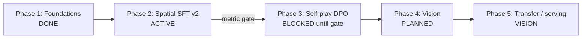

# systemone-lite Project Roadmap

> TypeSafe System One–compatible typed decision engine →
> spatial SFT → light self-play RL → vision reflex → (aspirational) agent transfer.

Tracking issues: [#6](https://github.com/fritzprix/systemone-lite/issues/6) Phase 1 (done) ·
[#2](https://github.com/fritzprix/systemone-lite/issues/2) Phase 2 ·
[#1](https://github.com/fritzprix/systemone-lite/issues/1) / [#3](https://github.com/fritzprix/systemone-lite/issues/3) Phase 3 ·
[#4](https://github.com/fritzprix/systemone-lite/issues/4) Phase 4 ·
[#5](https://github.com/fritzprix/systemone-lite/issues/5) Phase 5.

Measured Phase 1 note: [`NOTE_MIXED_SFT_2026-09-20.md`](NOTE_MIXED_SFT_2026-09-20.md).
Bare-face demos: [`benchmarks/demos/README.md`](../benchmarks/demos/README.md).

---

## Core vision

1. **System 1 shape**: typed decisions via **option-constrained next-token scoring** (not free-form JSON generation). Latency is payload-dependent; short 1-question benches can be tens of ms on RTX 3060, multi-question chess demos are hundreds of ms — do not treat “10–50ms everywhere” as a current product guarantee.
2. **Wire protocol**: keep `POST /v1/systemone` (noul / choice / score) compatible with the public TypeSafe shape.
3. **Transfer hypothesis** (not yet proven): skills from strict games (chess, spatial puzzles) may transfer to routing / later GUI tasks. Gate claims on held-out metrics, not GIFs.
4. **Consumer GPU**: prefer training loops that fit RTX 3060 12GB (8-bit optim, LoRA, offline ref logprobs for DPO).

---

## Phase summary

| Phase | Status | Issue |
|---|---|---|
| 1 Foundations | **Done** | [#6](https://github.com/fritzprix/systemone-lite/issues/6) |
| 2 Spatial SFT v2 | **Active** | #2 |
| 3 Ultra-light RL | Design ready; **start only after Phase 2 gate** | #1 (DPO), #3 (VRAM) |
| 4 Vision | Planned | #4 |
| 5 Transfer / prod | Vision | #5 |

---

## Phase 1 — Foundations & TypeSafe compatibility

> **Status: Done** (2026-09-20). Issue [#6](https://github.com/fritzprix/systemone-lite/issues/6). Checkpoint `checkpoints/systemone-mixed-sft` / HF `dwidlee/systemone-lite-0.5b`.

**Goal:** Wire-compatible API + honest 0.5B SFT baseline.

**Done:**

- [x] FastAPI `POST /v1/systemone` (noul / choice / score)
- [x] Prefix KV + option-restricted softmax scoring
- [x] Mixed SFT from base: general (ticket/alloc/debate) + chess `board_2d_map`, 43.2k stratified (`10.8k` × 4 gyms)
- [x] Chess distill at **~5k positions** scale (not 100k) + 2-stage demo scripts
- [x] Option-order / alias bias mitigated in eval (shuffle); FEN-only inflated scores retired
- [x] HF publish + measured report [`benchmarks/mixed_vs_base_report.json`](../benchmarks/mixed_vs_base_report.json)

**Honest numbers (base → mixed):**

| Bench | Base | Mixed SFT |
|---|---|---|
| General iid | ~0.44 | ~0.78 |
| General hard | ~0.43 | ~0.73 |
| Chess move (`board_2d` + shuffled) | ~0.05 | ~0.24 |

Bare-face demos (no tactical keywords / no solver override): SFT keeps a weak opening-knight preference; **no** reliable tactics; 2048 / GridWorld / Sokoban / Connect4 remain near zero-shot — motivates Phase 2.

---

## Phase 2 — Spatial intelligence & multi-game gym (ACTIVE)

> **Status: Infra exists; training data + co-train + honest eval not done.** Issue [#2](https://github.com/fritzprix/systemone-lite/issues/2).

**Goal:** Inject path / push / merge / gravity skills via text-map gyms **without** prompt heuristics or solver overrides.

**Done (infra only):**

- [x] Gym + synth code: Sokoban, 2048, GridWorld, Connect Four
- [x] Interactive demos (`scripts/*_demo.py`) with bare option labels + disabled BFS/`best_move_*` overrides

**Todo:**

- [ ] **$D_4$ / mirror augmentation** + isomorphic action permutation  
  - GridWorld / Sokoban / 2048: up to 8-fold dihedral  
  - Connect Four: horizontal mirror only (gravity)
- [ ] **Spatial distill JSONL** (solver / BFS / heuristic **labels**, bare **criteria text**)
- [ ] **Mixed v2** co-train: spatial + chess `board_2d` + general (balanced caps)
- [ ] **Eval suite** (required):
  - held-out iid per gym
  - option-order shuffle
  - rotation / mirror invariance where applicable
  - **bare-label** prompts (no `CAPTURES` / `RECOMMENDED` / `BLOCKED` coaching)
  - demos must not silently replace model actions with solvers
- [ ] Checkpoint `checkpoints/systemone-spatial-v2` + report under `benchmarks/`

**Exit gate (must pass before Phase 3):**

1. On bare-label spatial held-out: clear lift vs Phase 1 mixed / base (document Δ per gym).
2. Chess shuffled 2D accuracy **does not regress** vs Phase 1 (~0.24) by more than a small tolerance (e.g. −0.03).
3. General iid / hard stay within tolerance of Phase 1 (no catastrophic forgetting).
4. Invariance bench: rotated/mirrored boards do not collapse accuracy vs canonical.

---

## Phase 3 — Ultra-light self-play RL (gated)

> **Status: Design ready. Do not start full self-play DPO until Phase 2 exit gate.**  
> Issues [#1](https://github.com/fritzprix/systemone-lite/issues/1) (DPO / self-play), [#3](https://github.com/fritzprix/systemone-lite/issues/3) (8-bit / LoRA / ref cache).

**Goal:** Improve policies from outcomes on 12GB VRAM via **single-token DPO / GRPO**, not full actor–critic.

**Todo:**

- [ ] 8-bit AdamW + optional LoRA (enabler for larger batches / RL loops) — #3
- [ ] Offline reference logprob cache (no live `ref_model` in VRAM) — #3
- [ ] Self-play rollouts (chess, later Connect4) + chosen/rejected pairing — #1
- [ ] Single-token DPO / GRPO trainer — #1
- [ ] Eval: self-play score / Elo-style vs SFT and simple baselines (minimax / Stockfish level caps) — #1

**Note:** Sub-15ms / move in rollouts is a **target under a fixed short payload**, not the current multi-question chess demo average.

---

## Phase 4 — Multimodal vision System One (planned)

> **Status: Planned.** Issue [#4](https://github.com/fritzprix/systemone-lite/issues/4). Depends on Phase 2–3 text policies being real.

**Goal:** Optional `state.image` while keeping the same decision wire format.

**Todo:**

- [ ] Wire-compatible image field in `state`
- [ ] Compact VLM / encoder+projector on ~0.5B language side; **measure** latency (aspire &lt;100ms class on 3060, do not claim 50ms until benched)
- [ ] Frame stacking (2–4) for motion
- [ ] Atari / retro BC prototype (Pong / Breakout)

---

## Phase 5 — Universal transfer & production (vision)

> **Status: Vision / research.** Issue [#5](https://github.com/fritzprix/systemone-lite/issues/5).

**Goal:** Test whether game-honed System 1 skills transfer; harden serving if they do.

**Todo:**

- [ ] Define **transfer success metrics** before claiming Game-to-GUI wins (task success, not vibe)
- [ ] Probe OSWorld / WebArena-style subsets only after Phase 4 exists
- [ ] Serving: vLLM / SGLang prefix cache + quantization; report p50/p99 on a **declared** payload (15ms p99 is aspirational)
- [ ] Tech report + release notes tied to reproducible `benchmarks/*.json`

---

## Evaluation honesty (applies to all phases)

1. **Metrics &gt; demos.** GIFs and self-play anecdotes are illustrations; JSON reports are claims.
2. **Shuffle option order** on choice tasks unless studying position bias deliberately.
3. **No keyword coaching** in criteria when claiming spatial/chess competence (`CAPTURES`, `RECOMMENDED`, …).
4. **No silent solver overrides** in demo or eval loops.
5. Prefer **`board_2d_map` (or equivalent grid)** over FEN-only / coordinate-only state for spatial domains.
